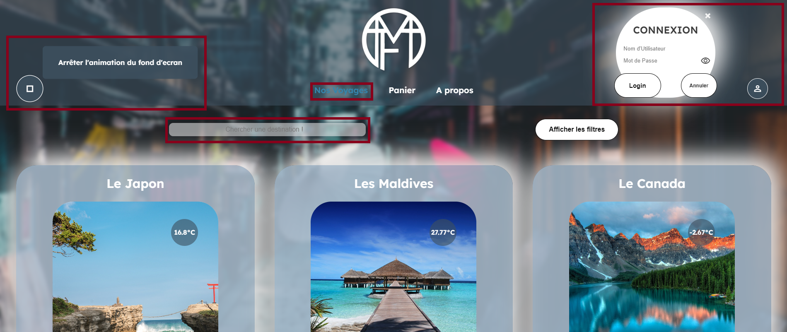
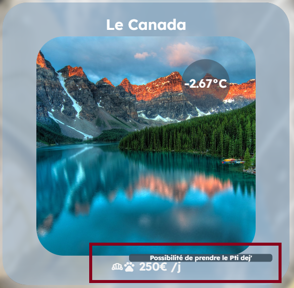
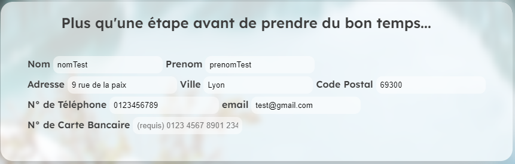
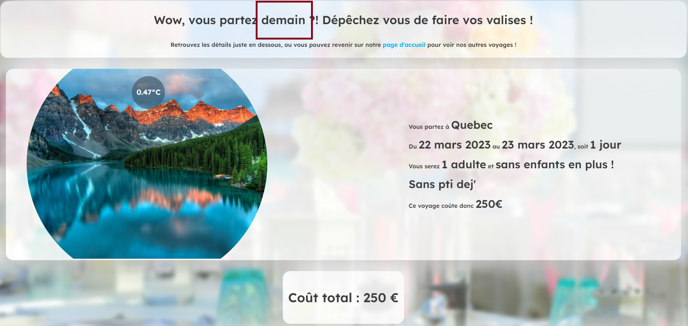

# Projet WEB - Agence de Voyages 
## *3IRC - 2022/2025*
## DUBOIS Maxime & MAILHEBIAU Damien

## Fonctionnalités de base

Toutes les fonctionnalités demandées sont implémentées.

## Fonctionnalités ajoutées
### Toutes les pages
- Background dynamique : tous les voyages défilent en arrière-plan, sauf sur la page panier qui ne fait défiler que les 
voyages du panier et la landing page qui a une image fixe
- Ajout d'un favicon
- Le logo du site a été créé par nous

### Page landing-page.html
- Ajout d'une page de landing pour accéder au site.

### Page index.html

- Ajout d'un bouton à gauche dans le header pour arrêter/démarrer le défilement du fond d'écran. Le pictogramme change 
selon le mode choisi.
- Les liens vers les différentes pages se colorent selon où on se trouve
- Ajout d'une barre de recherche pour trouver une destination, et texte personnalisé si pas de résultat
- Ajout d'une fenêtre modale de connexion

- Affichage texte des pictogrammes sous chaque voyage au survol de la souris

### Page panier.html

- Possibilité de modifier ou supprimer un élément du panier

- Les reservations sont triées par date croissante
- Les critères (dates, case petit dej...) sont gardés de la page index et inversement
- Informations utilisateur préremplies si on est connecté (sauf n° de carte)

- Si le panier est vide, affichage d'un message

### Page confirmation.html

- Calcul et affichage du nombre de jours restant avant le départ

### Page compte.html

- Affichage des infos utilisateur
- Affichage de l'historique des voyages : l'historique est écrit en dur dans le `users.json`, car on ne peut pas écrire et
/ou modifier l'historique des utilisateurs en JS.

## Optimisations 
- Requête API : si on a déjà la température, on ne refait pas de requête, elle est stockée dans le `SessionStorage`
- Fetch JSON : on récupère les données de tous les voyages une fois dans le JSON, et on les stocke dans le `SessionStorage`.
Tant que le `SessionStorage` n'est pas vide, on ne refait pas de requête pour les voyages.

## Différentes façons de faire dans le code
Ici il s'agissait surtout d'explorer les différentes possibilités que nous avions, même si sur un vrai projet il vaut mieux uniformiser ces méthodes.

- fetch User : appel depuis `script.js` les fonctions nécessaires en fonction de la page
- fetch Voyages : appel de la fonction `start()`, redéfinie dans chaque fichier JS nécessaire
- jQuery / getElementBy...
- Dans le HTML : `onclick=` / Dans le JS : `addEventListener`

---
# IDEES / TODO

- [x] ~~adulte(s) a remplacer par singulier et pluriel~~
- [x] ~~harmoniser le style de tous les inputs~~
- [x] ~~background "live" => faire défiler les photos des destinations sur landing et index~~
- [x] ~~background "conditionnel" sur detail sejour~~
- [x] ~~Panier click sur la destination pour aller vers la page détail sejour~~
- [x] ~~Caroussel image buggé~~
- [x] ~~Panier > background ne change pas tout seul~~
- [x] ~~Panier > pas de fond d'écran par défault~~
- [x] ~~Une recherche de destination~~
- [x] ~~optimiser requete API : si on a deja la T°C on refait pas de requete~~
- [x] ~~authentification~~
- [x] ~~historique des voyages mode dur~~
- [x] ~~bouton modifier panier : sur la meme page ! remplacer les lignes correspodnantes~~
- [x] ~~Panier "Attention modification en cours"~~
- [x] ~~Accessibilité~~
- [x] ~~w3school~~
- [ ] virer le .html dans l'url
- [ ] arriver sur la landing page du site
- [ ] historique des voyages mode dynamique
- [ ] pop up accepter les cookies a l'arrivée
- [ ] responsive
- [ ] ajouter prévisions météo ?
- [ ] ajouter heure locale
- [ ] Modification plusieurs destinations à la fois
- [ ] Panier > bouton "Ajouter un voyage"

# Questions
- Compatibilité navigateurs > Firefox / chrome
- JSON 
- User dans le même ou un nouveau JSON
- Sécurité ? > non
- Gestion des cas particuliers (suppression des données, modification cookies, ...) > NOn
