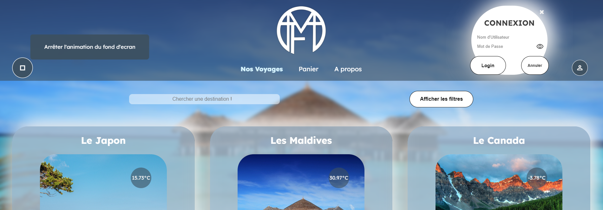
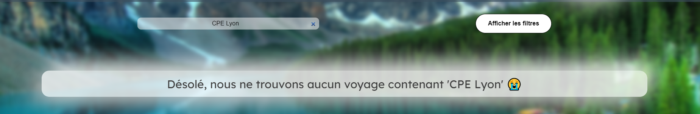
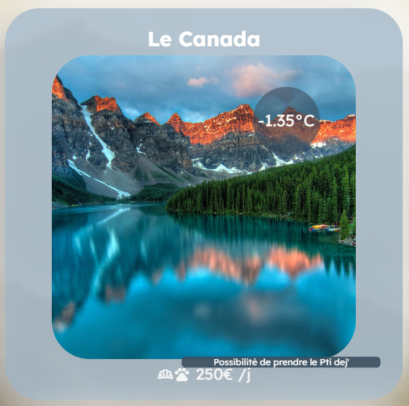
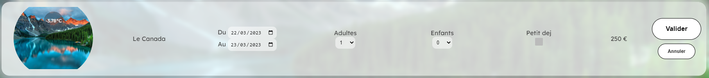
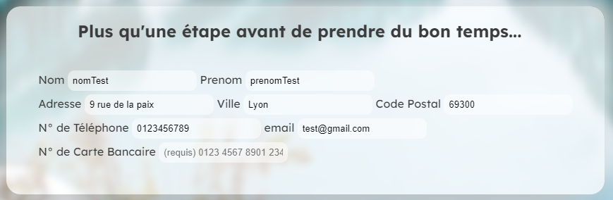
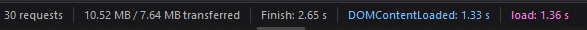
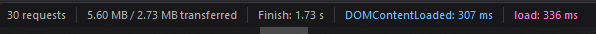

# Projet WEB - Agence de Voyages 
## *3IRC - 2022/2025*
## DUBOIS Maxime & MAILHEBIAU Damien

## Fonctionnalités de base

## Clé API
Insérer sa clé API dans le fichier `script/apikey.js`

Toutes les fonctionnalités demandées sont implémentées (excepté pour la disponibilité en fonction de la date).

Entièrement codé en HTML, CSS, JavaScript.

jQuery est la seule librairie utilisée.

Le responsive n'a pas été notre priorité.

Pour ce qui est de la répartition du travail : Au début, Maxime était plus côté JS et Damien était plus côté HTML/CSS.
Au fur et à mesure que l'on avançait, nous nous sommes un peu plus repartis les tâches. 
On peut résumer ça par ce tableau :

|            | HTML | CSS | JS  |
|------------|------|-----|-----|
| **Damien** | 70%  | 90% | 25% |
| **Maxime** | 30%  | 10% | 75% |

Bien que ce tableau ne soit pas réellement représentatif, il donne une idée de notre répartition globale de travail.
Nous avons beaucoup travaillé ensemble "en physique", du coup nous nous entraidions dès qu'il y avait un bloquant, 
un bug, etc. Au final, nous avons tous les 2 travaillés sur l'ensemble du projet, HTML, CSS et JS. 
Nous avons quand même suivi assez scrupuleusement un workflow Git.

## Fonctionnalités ajoutées
### Toutes les pages
- Background dynamique : tous les voyages défilent en arrière-plan toutes les 4s, sauf sur la page panier qui ne fait 
défiler que les voyages du panier, la page index qui a une image fixe,et le detail-sejour qui a son background 
## Fonctionnalités ajoutées 
### Toutes les pages [Responsable fonction]
- [Damien] Background dynamique : tous les voyages défilent en arrière-plan toutes les 4s, sauf sur la page panier qui ne fait 
défiler que les voyages du panier, la page index qui a une image fixe, et le detail-sejour qui a son background 
conditionné par la photo du séjour affichée.
- [Damien] Ajout d'un favicon
- [Damien] Le logo du site a été créé par nous
- Pour tester le login : 

| **usernames** | lolo | mimi | lili | toto |
|---------------|------|------|------|------|
| **passwords** | 1234 | 1234 | 1234 | 1234 |

**PS : On vous conseille de vous connecter avec lolo...**

- [Maxime] Mots de passe stocké en MD5 (C'est mieux que rien)
- [Maxime] Cookie Username stocké en MD5 aussi

### Page index.html
- [Damien] Ajout d'une page de landing pour accéder au site.

### Page accueil.html

- [Damien] Ajout d'un bouton à gauche dans le header pour arrêter/démarrer le défilement du fond d'écran. Le pictogramme change 
selon le mode choisi.
- [Damien] Les liens vers les différentes pages se colorent selon où on se trouve
- [Maxime] Ajout d'une barre de recherche pour trouver une destination, et texte personnalisé si pas de résultat
- [Maxime] Blocage des dates incorrects (avant demain et avant la date de début)
- [Damien] Ajout d'une fenêtre modale de connexion

- [Damien] Affichage texte des pictogrammes sous chaque voyage au survol de la souris

### Page Détail séjour

- [Maxime] Changement d'image par les fleches clavier
- [Maxime] Blocage des dates incorrects (avant demain et avant la date de début)

### Page panier.html

- [Maxime] Possibilité de modifier ou supprimer un ou **plusieurs** élément(s) du panier

- [Maxime] Ajout d'un message quand les modifications ne sont pas enregistrées
- [Maxime] Les reservations sont triées par date croissante
- [Maxime] Les critères (dates, nombre de personnes, case petit dej...) sont gardés quand on change de page
- [Damien] Informations utilisateur préremplies si on est connecté (sauf n° de carte)

- [Damien] Si le panier est vide, affichage d'un message

### Page confirmation.html

- [Damien] Calcul et affichage du nombre de jours restants avant le départ

### Page compte.html

- [Damien] Affichage des infos utilisateur
- [Damien] Affichage de l'historique des voyages : l'historique est écrit en dur dans le `users.json`, car on ne peut pas écrire et
/ou modifier l'historique des utilisateurs en JS.

## Optimisations 
- [Maxime] Requête API : si on a déjà la température, on ne refait pas de requête, elle est stockée dans le `SessionStorage`
- [Maxime] Fetch JSON : on récupère les données de tous les voyages une fois dans le JSON, et on les stocke dans le `SessionStorage`.
Tant que le `SessionStorage` n'est pas vide, on ne refait pas de requête pour les voyages.
- [Maxime] Optimisation du temps de chargement des pages ansi que du volume de donnés chargés (passage des images de jpg vers webp)

Avant : 

Après : 

## Différentes façons de faire dans le code
Ici il s'agissait surtout d'explorer les différentes possibilités que nous avions, même si sur un vrai projet il vaut mieux uniformiser ces méthodes.

- `fetchUser` : appelle depuis `script.js` les fonctions nécessaires en fonction de la page
- `fetchVoyages` : appel depuis `script.js`, de la fonction `start()`, redéfinie dans chaque fichier JS nécessaire
- jQuery / getElementBy...
- Dans le HTML : `onclick=` / Dans le JS : `addEventListener`

# OUTILS / Sites utilisés
- Les box-shadow ont été générées grâce à : https://neumorphism.io/#e0e0e0
- Certains styles (button, checkbox) ont été trouvés sur : https://uiverse.io/
- Le Rolling Text de la landing page a été trouvé sur : https://www.rareprogrammer.com/rolling-text-effect-using-css/
- Le logo du site a été designé sur Procreate (iPad)
- Certaines sources sont citées dans les commentaires du code

---

# IDEES / TODO

- [x] ~~adulte(s) a remplacer par singulier et pluriel~~
- [x] ~~harmoniser le style de tous les inputs~~
- [x] ~~background "live" => faire défiler les photos des destinations sur landing et index~~
- [x] ~~background "conditionnel" sur detail sejour~~
- [x] ~~Panier click sur la destination pour aller vers la page détail sejour~~
- [x] ~~Caroussel image buggé~~
- [x] ~~Panier > background ne change pas tout seul~~
- [x] ~~Panier > pas de fond d'écran par défault~~
- [x] ~~Une recherche de destination~~
- [x] ~~optimiser requete API : si on a deja la T°C on refait pas de requete~~
- [x] ~~authentification~~
- [x] ~~historique des voyages mode dur~~
- [x] ~~bouton modifier panier : sur la meme page ! remplacer les lignes correspodnantes~~
- [x] ~~Panier "Attention modification en cours"~~
- [x] ~~Accessibilité~~
- [x] ~~w3school~~
- [x] ~~Background détail séjour~~
- [ ] ~~virer le .html dans l'url~~
- [ ] ~~arriver sur la landing page du site~~
- [ ] ~~historique des voyages mode dynamique~~ > Annulé car on ne peut pas écrire et/ou modifier l'historique des utilisateurs en JS.
- [ ] pop up accepter les cookies à l'arrivée
- [ ] responsive
- [ ] ajouter prévisions météo ?
- [ ] ajouter heure locale
- [X] ~~Modification plusieurs destinations à la fois~~
- [ ] Panier > bouton "Ajouter un voyage"
- [ ] **Détail-séjour : Page 404 destination not Found** 
- [ ] Animation background : keyframes perso

# Questions
- Compatibilité navigateurs > Firefox / chrome
- JSON 
- User dans le même ou un nouveau JSON
- Sécurité ? > non
- Gestion des cas particuliers (suppression des données, modification cookies, ...) > NOn
